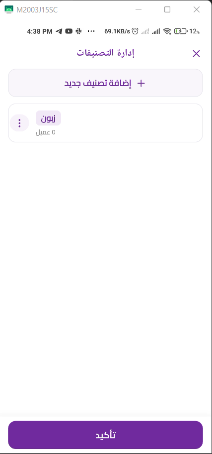
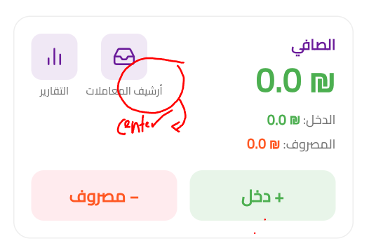
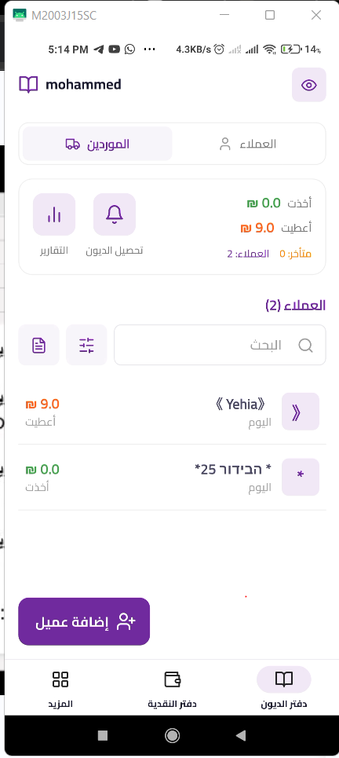
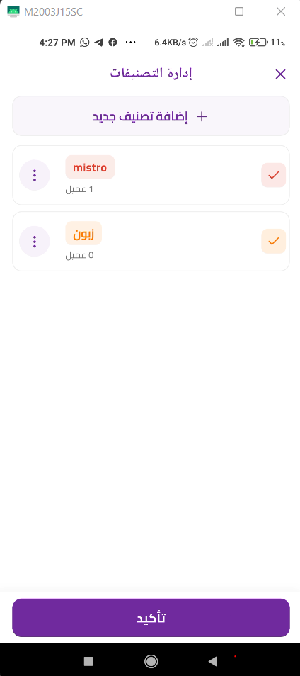
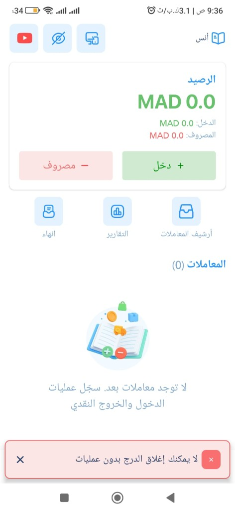

# 📱 Safi - الصافي

A comprehensive Flutter application for managing debts, customer accounts, and financial tracking.
تطبيق متكامل لإدارة الديون، حسابات العملاء، والتتبع المالي.

---

## ⚠️ Important Note / ملاحظة هامة للتسجيل
> **رمز التحقق الافتراضي هو `123456`**  
> **The default verification code is `123456`**

---

## ✨ Features / المميزات
* 👥 **إدارة العملاء (Customer Management)**: إضافة وإدارة ملفات العملاء بسهولة.
* 💰 **تتبع الديون (Debt Tracking)**: تسجيل الديون والمدفوعات والسجلات المالية بدقة.
* 📊 **التقارير (Reporting)**: استخراج تقارير مالية تفصيلية وإيصالات PDF.
* 🔔 **الإشعارات (Notifications)**: تنبيهات بمواعيد السداد والأرصدة المستحقة.
* 🔒 **الأمان (Security)**: مصادقة آمنة وحماية للبيانات.

## 🛠️ Tech Stack / التقنيات المستخدمة
* **Framework:** Flutter (Dart)
* **Backend:** Firebase (Auth, Cloud Firestore)
* **State Management:** Riverpod
* **UI Components:** Material Design, Fl Chart
* **Others:** Shared Preferences, Permission Handler, Printing, Syncfusion PDF

## 🚀 Getting Started / دليل التشغيل

### Prerequisites / المتطلبات
* Flutter SDK (`^3.11.4`)
* Dart SDK
* إعداد مشروع Firebase (تأكد من وجود ملفات `google-services.json` و `GoogleService-Info.plist`)

### Installation / التثبيت
1. استنساخ المشروع (Clone the repository).
2. تثبيت الحزم البرمجية:
   ```bash
   flutter pub get
   ```
3. تشغيل التطبيق:
   ```bash
   flutter run
   ```

## 📱 Screenshots / لقطات الشاشة

تم جمع لقطات الشاشة من أصول المشروع (مجلد أصول Cursor)، ثم **إزالة التكرار** بحسب محتوى الملف (SHA-256). جميع الملفات الفريدة موجودة هنا:

**[`docs/screenshots/`](docs/screenshots/)** — **164** صورة بأسماء `01-screenshot.png` … `164-screenshot.png`.

### معاينة سريعة

| 01 | 02 | 03 |
|:---:|:---:|:---:|
|  |  |  |
| 04 | 05 | 06 |
|  |  |  |

لإضافة لقطة جديدة: انسخ ملف PNG إلى `docs/screenshots/`، حدّث الرقم أو الاسم، ثم أضف سطرًا في Markdown مثل ``.

---
*تم التطوير بكل ❤️ لصالح تطبيق الصافي.*